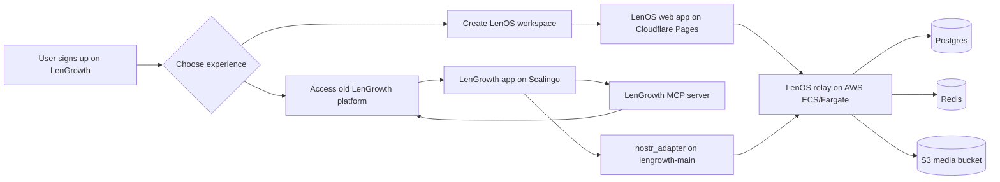

# LenGrowth Workspace Plan

This document is the top-level map for the LenGrowth workspace experience that lives in `LenOS` and connects back to `LenGrowth`.

The goal is simple:

- `LenGrowth` remains the business and signup platform.
- `LenOS` becomes the browser workspace at `slug.lengrowth.com`.
- Agents and automation in LenOS can create real work in LenGrowth.
- Desktop and mobile stay part of the product, but they are not the first surface to finish for this rollout.

## Current Architecture

### What each repo owns

| Repo | Owns |
|---|---|
| `LenOS` | Workspace UI, relay, desktop app, mobile app, shared event model, and AWS Terraform for the relay stack |
| `LenGrowth` | Signup flow, account linking, task/agent execution, MCP bridge, and the workspace provisioning contract |

### What is already in place

- LenOS web workspace exists and is deployed as a browser app.
- LenOS relay is deployed on AWS ECS behind an ALB and managed with Terraform in `infra/terraform/`.
- LenGrowth has the Nostr linking and MCP path documented in `docs/lenos-integration.md`.
- LenGrowth hosts `nostr_adapter` on the `lengrowth-main` Scalingo app.
- LenGrowth already gives new users two choices after signup: use the old platform or create a workspace.
- Workspace creation resolves to a subdomain like `acme.lengrowth.com`.

### Core runtime boundaries

- Browser traffic for the workspace goes to Cloudflare Pages.
- Relay traffic goes to `wss://relay.lengrowth.com`.
- LenGrowth API traffic goes to the Scalingo backend.
- Workspace identity comes from the subdomain and the LenGrowth workspace lookup.
- Message and automation state lives in the relay, not in the browser.

## Operational Notes

### Relay hosting

The relay stack is currently defined in `LenOS/infra/terraform/main.tf` and includes:

- VPC, subnets, and security groups
- RDS Postgres
- ElastiCache Redis
- S3 media bucket
- ECS Fargate service behind an ALB

This is the production anchor for the workspace event log.

### LenGrowth integration

The LenGrowth backend exposes the public workspace lookup and auth/linking flow that LenOS needs. The important contract is:

- a workspace slug maps to a relay community id
- the LenOS browser app learns the relay URL from configuration
- LenGrowth can create tasks and trigger agents on behalf of a linked Nostr identity

### CI note

The expensive `Build (linux/amd64)` job is part of the Docker image workflow in `.github/workflows/docker.yml`. That workflow runs on pushes to `main` and on `relay-v*` tags, so it is not a narrow app-only job. If you want to cut GitHub Actions time, the cleanest options are:

- separate verification from image publishing
- keep image builds on release/tag paths only
- tighten the path filter so workspace-only commits do not trigger relay image publication

## Delivery Phases

### Phase 1: Keep the workspace stable

Goal: make the browser workspace and relay stay healthy in production.

- Keep the relay deployed and reachable over WebSocket.
- Keep workspace subdomain routing stable.
- Keep the LenGrowth workspace lookup contract unchanged.
- Make sure login and workspace creation do not fight each other.

### Phase 2: Finish the browser workspace loop

Goal: a new workspace user can land in the browser, see channels, and use the workspace without needing the desktop app.

- Complete the Slack-like navigation and message surface.
- Make agent-created work visible in the workspace.
- Keep the old LenGrowth platform available as the alternate path.

### Phase 3: Connect work creation back to LenGrowth

Goal: workspace actions become real business tasks and agent jobs.

- Use the MCP bridge for task creation and metrics reads.
- Keep `nostr_adapter` publishing task completion notifications.
- Make workspace actions show up in LenGrowth in a traceable way.

### Phase 4: Bring desktop and mobile up to the new ambient

Goal: the non-web clients understand the workspace model.

- Update desktop to reflect the workspace-first product shape.
- Update mobile to match the same workspace identity and routing.
- Avoid introducing a separate logic path for each client.

### Phase 5: Reduce CI cost and deployment friction

Goal: make the repo cheaper to change without breaking release safety.

- Reduce how often the `linux/amd64` image build runs.
- Keep release images and verification tests separate.
- Preserve the checks that protect relay and workspace correctness.

### Phase 6: Remove old fork-era ambiguity

Goal: the documentation set tells one clear story.

- Prefer the root docs in this repo for current architecture.
- Keep older fork-era notes as historical references only.
- Link users to the shortest path for setup, deploy, and integration.

## Existing Docs That Still Matter

- `README.md` for the public project overview.
- `ARCHITECTURE.md` for the broader LenOS system design.
- `docs/lengrowth-integration-runbook.md` for the live integration checklist.
- `docs/web-workspace-ui-plan.md` for the browser workspace implementation history.
