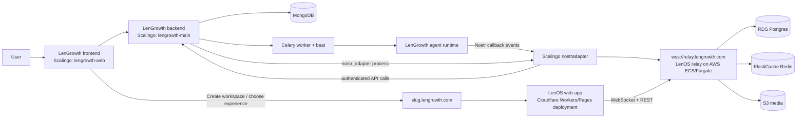

# LenOS / LenGrowth Workspace Architecture

**Status:** implementation snapshot and operational source of truth
**Updated:** 2026-08-06

## Live verification snapshot

Verified 2026-08-05 with the supplied test account: `e2etest26.lengrowth.com` exists and serves the LenOS browser shell. The shell renders workspace navigation for Channels, Inbox, Reminders, Workflows, Pulse, Agents, and Settings without a NIP-07 extension or imported key. The workspace currently has no channels or messages. The browser now presents that state as an explicit LenGrowth checklist: connect identity, provision starter channels, and add the growth team. It does not claim that clicking Agents provisions anything; browser agent provisioning is still unavailable, while desktop community onboarding provisions starter channels and agents.

This document describes the system that is actually present in the repositories. It separates code that exists from production paths that still need live verification.

## Product boundary

- `LenGrowth` remains the account, signup, legacy business application, task, metrics, and agent-execution system.
- `LenOS` is the workspace surface: browser UI, relay/event model, desktop, mobile, and relay infrastructure.
- A user can continue to the old LenGrowth platform or create a LenOS workspace.
- A workspace is addressed as `https://<slug>.lengrowth.com` (for example, `acme.lengrowth.com`).

## Runtime topology

## Ownership and interfaces

| Boundary | Current owner | Contract/evidence |
|---|---|---|
| Signup and legacy product | `LenGrowth` | Existing frontend/backend; post-signup experience choice is represented in the workspace plan and UI code. |
| Workspace record | `LenGrowth` | `backend/routes/lenos_workspace.py`; MongoDB `lenos_workspaces`; unique `slug` and `user_id` indexes. |
| Workspace URL | `LenGrowth` frontend + DNS/Cloudflare | `https://${user.lenos_workspace_slug}.lengrowth.com`; wildcard domain still needs live validation. |
| Browser workspace | `LenOS/web` | Web plan implements the Slack-like shell, channels, timeline, composer, routing, and related views. |
| Shared event transport | LenOS relay | `wss://relay.lengrowth.com`; relay is containerized and deployed through AWS Terraform/ECS. |
| LenGrowth identity link | `LenGrowth` | `POST/DELETE /api/auth/nostr-link`; records are stored in `nostr_links` and resolved by Nostr pubkey. |
| Commands and task creation | Scalingo `nostradapter` + LenGrowth MCP | Adapter handles HQ commands; MCP tools call LenGrowth APIs and attach `nostr_callback` for async agent work. |
| Agent execution | `LenGrowth` | Celery queues `execute_agent_analysis`; completion signals can publish Nostr callbacks. |
| Desktop/mobile clients | `LenOS/desktop`, `LenOS/mobile` | Present in the repo, but not yet aligned with the workspace-first ambient according to the current plans. |

## Request and event flows

### Signup to workspace

1. User signs up in LenGrowth.
2. LenGrowth offers the legacy platform or workspace creation.
3. `POST /api/workspace` creates one `lenos_workspaces` record per user, checks slug uniqueness, and provisions a relay community/event namespace.
4. The frontend builds the workspace URL from the stored slug.
5. The browser connects to the configured LenOS relay and loads the community identified by the workspace record.

### Workspace to LenGrowth task/agent

1. User mentions the LenGrowth agent in a workspace channel.
2. `nostradapter` receives the Nostr event from the HQ channel.
3. The adapter resolves the sender through `nostr_links`.
4. LenGrowth MCP calls the authenticated LenGrowth API. Task creation includes `nostr_callback` when an agent is requested.
5. Celery executes the agent.
6. Worker completion/failure signals publish a callback event to the relay so the workspace can show the result.

The adapter now implements task listing, metrics, task creation, and growth-agent triggering. MCP code also implements asset lookup and context lookup. The live end-to-end command and callback verification remains pending.

## Current onboarding reality

### Desktop

Desktop has the complete first-run experience today:

1. Reuse or create/import a durable Nostr identity.
2. Set a display name and avatar.
3. Check relay membership.
4. Create or join a community.
5. Ensure starter channels: `general` and `welcome-everyone`, plus a private `Welcome` channel.
6. Seed the Welcome channel with a canvas and the starter team: Fizz, Honey, and Bumble.
7. Configure a default ACP runtime/provider/model and enter LenOS.

The Welcome channel supports a chat-first agent setup path: the UI can send `@Fizz, help me create a new agent.` Desktop also has the manual agent-management surface.

### Browser

The browser now opens the shell without blocking on NIP-07. It can use an ephemeral identity for open/read-only relay browsing. Durable membership and identity-linked actions still need a durable identity. Once a NIP-07 identity is available, Inbox onboarding publishes starter channels and role-based remote-agent definitions directly to the workspace relay; this is a signed relay bootstrap, not a LenGrowth backend provisioning API.

### LenGrowth bridge

The bridge is not yet a general workspace integration. `nostradapter` still subscribes to the configured LenGrowth HQ channel UUID, so a mention in an arbitrary customer workspace channel will not reliably reach LenGrowth today. The parser now exposes task creation and agent-trigger commands, but those commands still require an active `nostr_links` record.

### Workspace provisioning contract

LenGrowth creates the relay community during `POST /api/workspace`, before inserting
the MongoDB `lenos_workspaces` record. It calls the relay operator API over HTTPS:

- `POST /operator/communities` with `{host, create_only: true, initial_owner_pubkey}`;
- NIP-98 authorization signed by the configured `NOSTR_PRIVATE_KEY`;
- on `409`, `GET /operator/communities?owner_pubkey=...` and an exact host match;
- no fallback to an unrelated community is allowed.

The MongoDB `user_id` and `slug` unique indexes are the final idempotency fence.
Concurrent requests converge to the winning workspace document. Starter resources
are a separate authenticated browser bootstrap step: after a durable NIP-07
identity is available, the browser publishes deterministic `kind:9007` channel
creation events and owner-authored `kind:30177` managed-agent definitions over
the workspace WebSocket. The four channel slugs are `general`,
`welcome-everyone`, `lengrowth`, and `tasks`; retries use the same channel UUID
or agent `d` tag, and an acknowledged relay duplicate is treated as success.
The relay WebSocket must be authenticated before publishing, so the UI surfaces
connection or relay rejection errors instead of claiming success.

### Verification state

- Implemented: exact-host relay lookup, concurrent workspace insert convergence, and
  path-filtered relay image CI with debug images restricted to relay tags.
- Tested locally: 12 focused LenGrowth backend tests and the LenOS browser
  TypeScript/Vite production build pass. Browser bootstrap now waits for relay
  authentication before publishing and converges on duplicate channel retries.
- Verified live: browser shell and public workspace lookup were verified earlier on
  `e2etest26.lengrowth.com`; on 2026-08-05 the deployed shell also showed the
  expected empty-workspace onboarding copy. Starter channels, agents, task
  dispatch, and callback completion are still not live-verified.

## Deployment surfaces

- LenGrowth frontend/backend: Scalingo apps `lengrowth-web` and `lengrowth-main`.
- LenGrowth background process: `nostradapter` is declared in `LenGrowth/backend/Procfile`.
- LenOS web: `.github/workflows/web-deploy.yml`, path-filtered to `web/**`, deploys with Wrangler.
- LenOS relay: `LenOS/infra/terraform/` defines the AWS stack; the current runbook records ECS task definition `lenos-relay:4`.
- Relay public endpoint: `relay.lengrowth.com`; production Nostr clients require WSS and the runbook calls out DNS/proxy requirements.

## Known architecture risks

1. Workspace provisioning is represented in LenGrowth code, but the full browser-to-relay-to-agent loop is not yet signed off by live E2E tests.
2. The relay community identifier is a critical join key. A relay reset or changed community ID requires updating the LenGrowth integration configuration.
3. Nostr link records are the authorization bridge. Disconnect/reconnect must remain idempotent and must not leave multiple active links.
4. The adapter currently has a fixed HQ subscription and command parsing. General workspace agent routing should not assume every workspace uses the HQ channel.
5. The old LenOS fork contains extensive historical docs. Current workspace decisions should use this file plus the root workspace plans and integration runbook.

## Related documents

- [LenGrowth workspace plan](LENGROWTH_WORKSPACE_PLAN.md)
- [Integration runbook](docs/lengrowth-integration-runbook.md)
- [Web workspace implementation plan](docs/web-workspace-ui-plan.md)
- [LenGrowth integration contract](../LenGrowth/docs/lenos-integration.md)
- [LenGrowth go-live plan](../LenGrowth/LENOS_GO_LIVE_PLAN.md)
